<div align="center">
  
</div>
<div align="center">
  A command-line utility to make <strong>Jianpu</strong> (numbered musical notation) playable on the flute in <strong>Animal Well</strong>. <br>
  This tool allows players to easily translate their favorite melodies into playable animal flute songs.
</div>

<p align="center">
  <br>
  <a href="https://www.python.org/">
    
  </a>
  <a href="https://opensource.org/licenses/MIT">
    
  </a>
</p>

## Quick Look

Here's a quick look at how the tool translates a song for the Animal Well flute:

<div align="center">
  
</div>

---

## Table of Contents

- [Quick Look](#quick-look)
- [Table of Contents](#table-of-contents)
- [Features](#features)
  - [TODO List](#todo-list)
- [How It Works](#how-it-works)
  - [Jianpu to Flute Conversion](#jianpu-to-flute-conversion)
  - [Jianpu Auto Importer](#jianpu-auto-importer)
- [Installation](#installation)
- [Usage](#usage)
  - [Interactive Mode](#interactive-mode)
  - [List Available Songs](#list-available-songs)
  - [Play a Song](#play-a-song)
    - [Advanced: Choosing a Conversion Strategy](#advanced-choosing-a-conversion-strategy)
  - [Analyze a Song](#analyze-a-song)
  - [Importing a Song from an Image (Experimental)](#importing-a-song-from-an-image-experimental)
- [Song File Format](#song-file-format)
- [Project Structure](#project-structure)
- [Contributing](#contributing)
- [License](#license)

## Features

- **Jianpu to Direction Conversion**: Automatically converts songs written in Jianpu into the game's 8-directional input sequence.
- **Song Library**: Manage a local library of songs defined in simple `.yaml` files.
- **CLI Player**: "Plays" songs in the terminal, displaying the sequence of directional inputs with timing.
- **Jianpu Auto Importer(Experimental)**: This feature parses an image of a numbered jianpu, converting it into the project's standard .yaml song format. Typically, only minor modifications are needed to make the song playable. **Only support Gemini-2.5 and Doubao Seed 1.6 now.**
- **Extensible**: Easily add new songs by creating new `.yaml` files.
- **Interactive TUI**: A user-friendly text-based interface for easy navigation and operation.

### TODO List

- [x] ~~**Expanded Song Library**: More pre-converted songs will be added to the library. Community contributions for new songs are highly encouraged!~~
- [x] ~~**Jianpu Auto Importer**: This feature parses an image of a numbered jianpu, converting it into the project's standard .yaml song format.~~
- [x] ~~**Interactive TUI**: A text-based user interface for selecting songs and functions is available via `python cli.py interactive`.~~
- [ ] **Full GUI Support**: A graphical user interface for a more visual experience.

## How It Works

### Jianpu to Flute Conversion

The flute in *Animal Well* is played using 8 directions on a controller, corresponding to the 8 notes of a C Major scale. The game also allows for pitch modification: holding the button that corresponds to note `1` while playing another note lowers its pitch by an octave, and holding the button for note `3` raises it by a semitone. This tool works by mapping the provided Jianpu notation to these in-game directional inputs, including the necessary holds for pitch shifting.

-   **Parse**: It reads the `jianpu` list from a `.yaml` song file.
-   **Convert**: It translates each Jianpu symbol (e.g., `5`, `h1`, `(3 2)`) into its corresponding directional input, applying any necessary transposition based on the chosen strategy.
-   **Play**: It displays the final directional sequence in the command line, providing a clear guide for in-game performance.

### Jianpu Auto Importer

This feature leverages a **multimodal large language model (MLLM)** to provide an end-to-end solution for converting Jianpu images directly into the project's `.yaml` song format. The MLLM handles the entire process seamlessly: it analyzes the image, recognizes the musical notation, and generates the final, structured `.yaml` content, automating the transcription process from start to finish.

```mermaid

flowchart LR

A["📄<br/>Jianpu Image"] --> B["🤖<br/>MLLM<br/>End-to-End Recognition"]

B --> C["📝<br/>YAML Song"]

C --> D["🎮<br/>Play in Animal Well!"]

style A fill:#fafafa,stroke:#424242,stroke-width:2px,color:#212121

style B fill:#e8f5e9,stroke:#4caf50,stroke-width:4px,color:#1b5e20

style C fill:#f3e5f5,stroke:#9c27b0,stroke-width:2px,color:#4a148c

style D fill:#e3f2fd,stroke:#2196f3,stroke-width:2px,color:#0d47a1

linkStyle 0 stroke:#4caf50,stroke-width:3px

linkStyle 1 stroke:#9c27b0,stroke-width:3px

linkStyle 2 stroke:#2196f3,stroke-width:3px

```



## Installation

1.  **Clone the repository:**
    ```bash
    git clone https://github.com/ADAning/animal-well-flute.git
    cd animal-well-flute
    ```

2.  **Install dependencies:**
    It is recommended to use a virtual environment.
    
    ```bash
    python -m venv venv
    source venv/bin/activate  # On Windows use `venv\Scripts\activate`
    pip install -r requirements.txt
    ```

## Usage

The tool is operated via `cli.py`.

### Interactive Mode

For a more user-friendly experience, you can run the tool in interactive mode. This provides a text-based user interface (TUI) to navigate through all available functions.

To start the interactive mode, run:
```bash
python cli.py interactive
```

### List Available Songs

To see all the songs currently in your `songs/` directory:

```bash
python cli.py list
```

### Play a Song

To "play" a song from your library, use the `play` command followed by the song's name. If you omit the song name, the tool will enter an interactive selection menu.

```bash
# Play a specific song
python cli.py play travelers

# Enter interactive mode to select a song
python cli.py play --interactive
```

This will output the directional sequence to your terminal.

**Additional Parameters:**

- `--bpm <number>`: Override the song's default BPM.
- `--ready-time <seconds>`: Set a custom countdown time before playing (in seconds).

**Example:**
```bash
python cli.py play travelers --bpm 100 --ready-time 5
```

#### Advanced: Choosing a Conversion Strategy

Some songs may contain notes that are outside the flute's default playable range. The `--strategy` flag allows you to control how the tool handles these cases by transposing the song.

```bash
python cli.py play <song_name> --strategy <strategy_name> [parameter]
```

**Available Strategies:**

- **`auto [high|low|optimal]`**: Automatically selects the best strategy among `high`, `low`, and `optimal`. You can provide an optional preference (e.g., `auto high`).
  - **`optimal` (Default):** Automatically calculates the best pitch shift (transposition) to fit the maximum number of notes into the flute's range.
  - **`high`**: Prefers to transpose the song to a higher pitch.
  - **`low`**: Prefers to transpose the song to a lower pitch.
- **`manual <offset / song>`**: Manually specify a pitch shift in semitones. The `<offset>` can be a positive or negative number (e.g., `1.5`, `-2.0`). Or specify the offset in the song.
- **`none`**: Applies no transposition (`manual 0.0`).

**Example:**

If you want to play directly without adding complicated settings:

```bash
python cli.py play your_song
```

This is equivalent to using `--strategy auto optimal` by default.

If a song sounds too high, you can try playing it with a lower transposition:

```bash
python cli.py play your_song --strategy low
```

Or, manually transpose it down by two semitones:

```bash
python cli.py play your_song --strategy manual -2.0
```

If you wish to use the default offset in a specific song (if any):

```bash
python cli.py play your_song --strategy manual song
```

### Analyze a Song

To analyze a song's musical properties, such as its note range and optimal transposition, use the `analyze` command. This is useful for understanding how a song will be converted before you play it.

```bash
# Analyze a specific song
python cli.py analyze travelers

# Enter interactive mode to select a song to analyze
python cli.py analyze --interactive
```
The output will show the song's pitch range and provide suggestions for the best conversion strategies.

### Importing a Song from an Image (Experimental)

This tool can use AI to recognize a Jianpu image and automatically convert it into the `.yaml` song format.

**Setup:**

This feature requires an API key for either Google Gemini or Doubao. You must set the corresponding environment variable:

-   **For Gemini**: `GOOGLE_API_KEY`
-   **For Doubao**: `ARK_API_KEY`

> **Note**: Please use `GOOGLE_API_KEY` for the Gemini service. This specific variable name is used to avoid conflicts with other tools, such as `gemini-cli`, which may use `GEMINI_API_KEY`.

You can check the status of the AI services with:
```bash
python cli.py ai-status
```

**Usage:**

To import a song, use the `import` command. You can provide a path to a single image file or a directory.

```bash
# Import a single image
python cli.py import path/to/your/song.png

# Import all images from a directory (defaults to the 'sheets/' directory)
python cli.py import
```

**Additional Parameters:**
- `--ai-provider <gemini|doubao>`: Specify which AI service to use.
- `--output-dir <path>`: Specify a custom output directory for the generated `.yaml` file.
- `--debug`: Display detailed debugging information, including the raw response from the AI model. This is useful for troubleshooting.

-   **Automatic Merging**: If a directory contains multiple images, the tool will treat them as pages of the same song and merge them into a single `.yaml` file. The images are processed in alphabetical order.

**Note**: This is an experimental feature. The AI-generated `.yaml` file may require manual corrections for accuracy.

## Song File Format

Songs are defined in `.yaml` files using a format based on **Jianpu**.

**Keys:**

- `name` (string): The name of the song.
- `bpm` (integer): The tempo of the song in beats per minute.
- `jianpu` (list of strings): The core of the song, written in a specialized Jianpu format. Each string in the list typically represents a bar of music.
- `offset` (float, optional): A default transposition in semitones for the song.
- `description` (string, optional): A brief description or note about the song.

**Jianpu Format Details:**

The `jianpu` format uses numbers `1-7` to represent notes. Special characters and notations are used for rhythm, octaves, and rests:

- **Octaves**: `h` for high (e.g., `h1`), `l` for low (e.g., `l6`).
- **Rhythm**: Parentheses `()` are used for shorter notes, and `d` might indicate a dotted note (e.g., `5d`).
- **Rests**: `0` represents a rest.

**Example (`songs/travelers.yaml`):**

```yaml
name: Travelers
bpm: 90
offset: 0.0
jianpu:
- 1 5 7 (0 5) | (h1 7) (6 5) (6 7) 5 | 
- 2 5 7 (0 5) | (h1 7) (6 5) (6 7) (h2 7) |
- 3 5 7 (0 5) | (h1 7) (6 5) (6 7) 5 |
- 2 5 7 (0 5) | (h1 7) (6 5) (6 7) (h2 7) |
description: "Outer Wilds (Travelers' encore)"
```

## Project Structure

```
animal-well-flute/
├── cli.py              # Main CLI entry point
├── requirements.txt    # Project dependencies
├── songs/              # Directory for song .yaml files
│   ├── example_song.yaml
│   └── ...
├── src/                # Source code
│   ├── core/           # Core logic (parsing, conversion, playing)
│   ├── data/           # Data models and song management
│   └── utils/          # Utility functions (e.g., logging)
└── tests/              # Unit tests
```

## Contributing

Contributions are welcome! If you have ideas for new features or improvements, please feel free to open an issue or submit a pull request.

1.  Fork the repository.
2.  Create a new feature branch (`git checkout -b feature/your-feature-name`).
3.  Commit your changes (`git commit -m 'Add some feature'`).
4.  Push to the branch (`git push origin feature/your-feature-name`).
5.  Open a Pull Request.

## License

This project is licensed under the MIT License - see the [LICENSE](LICENSE) file for details.
